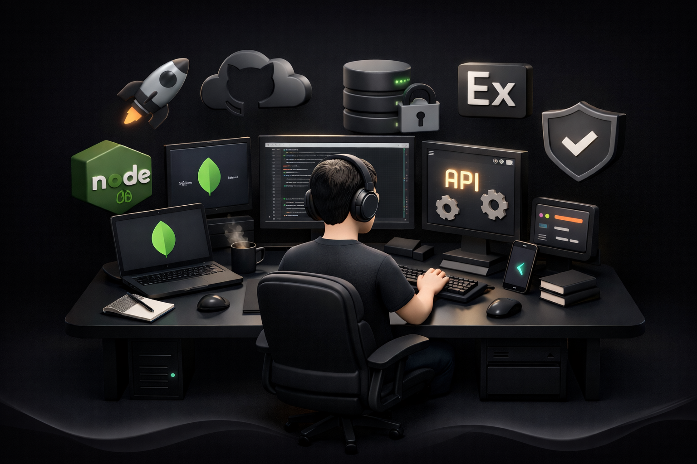

<!-- TOP ANIMATED WAVE -->

<!-- CUSTOM 3D ILLUSTRATION -->

<h1 style="color:#e5e7eb;">Shubham Kulkarni</h1>

  Full Stack Developer · MERN & Backend Specialist

  Building reliable, scalable web systems for real businesses

---

## About

I am a Full Stack Developer with a strong focus on backend engineering and system architecture.
I build applications that prioritize security, performance, and long-term maintainability.

  

My experience includes employee management systems, HR portals, internal dashboards,
and API-driven business applications.

---

## Core Expertise

• Backend-first application design  
• RESTful API development  
• Authentication & authorization  
• Role-based access systems  
• Business dashboards & internal tools  

---

## Technology Stack

### Frontend

  

### Backend

  

### Databases

  

### Tools & Platforms

  

---

## Selected Work

**Employee Management System**
- Full MERN stack application
- HR portal & admin dashboard
- Attendance & leave workflows
- Secure authentication & roles

 

**Admin Dashboards**
- API-driven data rendering
- Filtering & search
- Clean dark UI

 

**HR Portal**
- Employee onboarding
- Department & role management
- Document workflows

---

## GitHub Activity

---

## Availability

Open to full-time roles, freelance projects, and long-term collaborations.

---

## Contact

Email: yourprofessionalemail@example.com  
Portfolio: Coming soon  

---

  
    Building software that is dependable, readable, and built to last.
  

<!-- BOTTOM ANIMATED WAVE -->

